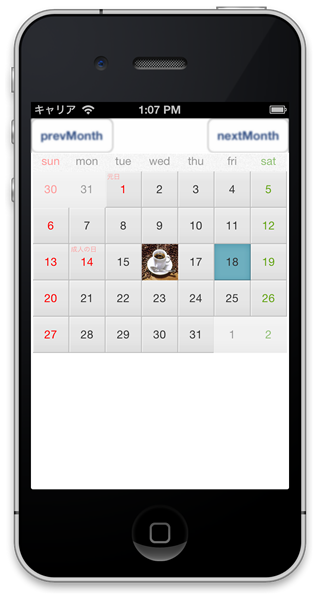

About
------
This is the calendar widget of Titanium Alloy.



Usage
------
Copy the `widgets` folder in `app/widgets` folder of your project.

For more information, please see the `sample` project.


#### show calendar ####
```javascript
var moment = require('alloy/moment'),
    month = moment();

var widget = Alloy.createWidget('jp.co.mountposition.calendar', 'widget', {period: month});
$.index.add(widget.getView());
```


#### set image ####
You can set original image into tile.
For example, Set the image into tiles of 16 day.

```javascript
widget.setImage(16, '/images/cafe.jpg');
```

#### select day ####
You can select tile by programatic.

```javascript
widget.select(18);
```

License
----------
Written by [@hamasyou](https://twitter.com/hamasyou/)
Copyright &copy; 2013 MountPosition Inc.
Licensed under the [MIT License][MIT]
[MIT]: http://www.opensource.org/licenses/mit-license.php


Reference
------
- [ThanksObento](http://mountposition.co.jp/obento/)
